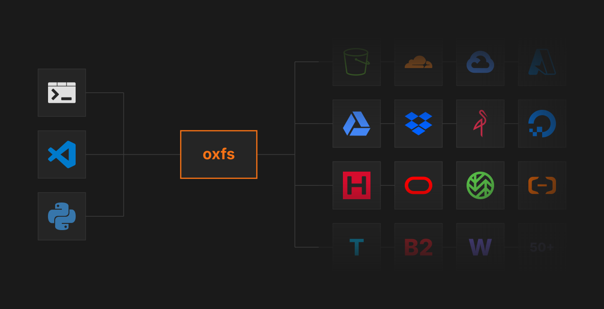

# oxfs

<p align="center">
  
</p>

FUSE filesystem backed by any object store, written in Rust.

Built on [fuser](https://github.com/cberner/fuser) and [Apache OpenDAL](https://github.com/apache/opendal). S3 keys map directly to file paths with no local metadata database. 50+ storage backends.

## Quick start

```bash
cargo build --release

# S3 / R2
AWS_ACCESS_KEY_ID=... AWS_SECRET_ACCESS_KEY=... \
./target/release/oxfs mount /mnt/oxfs \
  --backend s3 --bucket my-bucket --endpoint https://acct.r2.cloudflarestorage.com

# Local filesystem
./target/release/oxfs mount /mnt/oxfs --backend fs --root /tmp/oxfs-data

umount /mnt/oxfs
```

macOS: `brew install --cask macfuse` first (reboot required).

## Storage backends

oxfs uses [Apache OpenDAL](https://github.com/apache/opendal). Any S3-compatible endpoint works out of the box.

| Backend | Example |
|---------|---------|
| AWS S3 | `--backend s3 --bucket name --region us-east-1` |
| Cloudflare R2 | `--backend s3 --endpoint https://acct.r2.cloudflarestorage.com` |
| GCS | `--backend s3 --endpoint https://storage.googleapis.com` |
| MinIO | `--backend s3 --endpoint http://localhost:9000` |
| Tigris | `--backend s3 --endpoint https://fly.storage.tigris.dev` |
| Google Drive | `--backend gdrive --access-token $TOKEN` |
| Dropbox | `--backend dropbox --access-token $TOKEN` |
| Local disk | `--backend fs --root /path` |

`--prefix` scopes all keys within the bucket for per-session isolation.

## Architecture

oxfs has two modes, selectable via `--mode`:

**Flat (default)**: S3 keys map 1:1 to file paths. No local database, no chunking. What you see in the bucket is what you see in the mount. Comparable to GeeseFS and TigrisFS.

```
FUSE (fuser) -> FlatFuse -> OpenDAL
                   |
                stat/dir cache (moka, in-memory)
```

**Posix**: local metadata database with tiered caching, write-ahead log, and background compaction. 99.6% pjdfstest compliance (8755/8789 tests, Linux). Supports hard links, device nodes, symlinks, nanosecond timestamps, and other features that flat object storage cannot represent.

```
FUSE (fuser) -> VFS -> Cache (moka L1 + disk L2 + WAL) -> Data (OpenDAL)
                 |
              Metadata (redb or SQLite)
```

| Crate | Role |
|-------|------|
| oxfs-backend | Storage backend builder (S3, GDrive, Dropbox, local fs via OpenDAL) |
| oxfs-flat | Flat FUSE impl: direct S3 key-to-path mapping |
| oxfs-meta | MetaEngine trait, [redb](https://github.com/cberner/redb) and SQLite impls (posix mode) |
| oxfs-data | [OpenDAL](https://github.com/apache/opendal) wrapper for slice I/O (posix mode) |
| oxfs-vfs | Inode mgmt, cache, prefetch, compaction (posix mode) |
| oxfs-fuse | [fuser](https://github.com/cberner/fuser) Filesystem impl (posix mode) |
| oxfs | CLI binary |

## Configuration

```
oxfs mount <mountpoint>
  --backend <fs|s3|gdrive|dropbox>  Storage backend (default: fs)
  --mode <flat|posix>               Filesystem mode (default: flat)
  --root <path>                     Root dir for fs backend
  --bucket <name>                   S3 bucket
  --region <region>                 S3 region
  --endpoint <url>                  S3-compatible endpoint
  --prefix <path>                   Key prefix within bucket
  --access-token <token>            OAuth access token (gdrive, dropbox)
  --refresh-token <token>           OAuth refresh token (gdrive, dropbox)
  --client-id <id>                  OAuth client ID (gdrive, dropbox)
  --client-secret <secret>          OAuth client secret (gdrive, dropbox)
  --writeback                       Buffer writes, flush on close (flat mode)
  --default-permissions             Kernel-enforced permission checks
  -d, --daemonize                   Fork into the background

  # Posix mode only:
  --meta-db <path>                  Metadata database (default: oxfs.db)
  --meta-backend <redb|sqlite>      Metadata engine (default: redb)
  --cache-mem-mb <N>                L1 memory cache MB (default: 256)
  --cache-disk-path <path>          L2 disk cache directory
  --cache-disk-mb <N>               L2 disk cache MB (default: 1024)
  --wal-path <path>                 Write-ahead log (crash recovery)
```

## Benchmarks

Flat mode vs GeeseFS and TigrisFS against Cloudflare R2 (median of 3 runs, Linux aarch64 in Docker):

| Metric | oxfs | geesefs | tigrisfs |
|--------|------|---------|----------|
| single file roundtrip | 3578ms | **8ms** | - |
| create 10 files | 22557ms | **903ms** | - |
| read 10 files | 5673ms | **16ms** | - |
| write 256KB | 3271ms | **11ms** | - |
| stat 10 files | 2718ms | **15ms** | - |
| mkdir+rmdir 5 dirs | 11687ms | **16ms** | - |
| rename 5 files | 30443ms | **20ms** | - |
| symlink roundtrip | 7572ms | **12ms** | - |

oxfs flat mode currently does synchronous S3 calls on most FUSE operations. GeeseFS uses aggressive write-back buffering and in-memory caching. Performance optimization (longer cache TTLs, write-back buffering, negative caching) is in progress.

Reproduce: `docker build -f bench/Dockerfile -t oxfs-bench . && docker run --rm --privileged -e R2_ACCOUNT_ID=... -e R2_ACCESS_KEY_ID=... -e R2_SECRET_ACCESS_KEY=... oxfs-bench`

## License

MIT OR Apache-2.0
